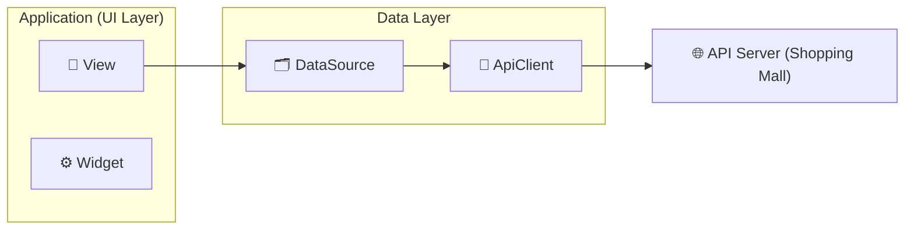

# ON-WOORI (온우리) | 생활 한복 전문 플랫폼

**"전통과 현대를 잇는 생활 한복 전문 플랫폼, 온우리"**

'온우리'는 흩어져 있는 생활 한복 브랜드와 상품 정보를 한곳에 모아, 사용자들이 편리하게 탐색하고 구매할 수 있도록 돕는 통합 커머스 플랫폼입니다. 제작자와 소비자를 직접 연결하여 정보 비대칭 문제를 해결하고, 생활 한복 시장의 활성화를 목표로 합니다.

---

## 목차

- [팀원 소개](#-팀원-소개)
- [프로젝트 목표](#-프로젝트-목표)
- [주요 기능](#-주요-기능)
- [기술 스택 및 의존성](#-기술-스택-및-의존성)
- [아키텍처](#-아키텍처)
- [요구사항](#-요구사항)

---

## 🧑‍💻 팀원 소개

**멋쟁이사자처럼 앱 스쿨 : 안드로이드 4기 2조 (안동찜닭)**
| 이름 | 역할 |
| :---: | :--- |
|  
신서진
 | 
👑 팀장 
 
|  
김인태
 | 
부팀장 
 
|  
정가은
 | 
팀원 

|  
안현진
 | 
팀원 

---

## 🎯 프로젝트 목표

1.  **정보 통합 플랫폼 구축**: 다양한 생활 한복 브랜드와 펀딩 상품 정보를 한곳에서 제공하여 사용자의 탐색 비용을 절감합니다.
2.  **정보 비대칭 해소**: 제작자와 소비자를 직접 연결하여 투명하고 신뢰도 높은 거래 환경을 조성합니다.
3.  **편리한 사용자 경험 제공**: 직관적인 UI와 카테고리별 분류, 위시리스트, 장바구니 등 편리한 쇼핑 기능을 통해 만족도 높은 사용자 경험을 제공합니다.

---

## ✨ 주요 기능

### 👤 공통 및 사용자 관리
- **로그인/로그아웃**: 이메일과 비밀번호를 통한 안전한 인증 및 로그아웃 기능을 제공합니다.
- **통합 회원가입**: 구매자와 판매자 모두 기본 정보 입력으로 간편하게 가입할 수 있습니다.
- **판매자 추가 정보**: 판매자는 가입 후 사업자 및 브랜드 정보를 추가로 등록할 수 있습니다.
- **비밀번호 변경**: 마이페이지에서 현재 비밀번호 확인 후 안전하게 새 비밀번호로 변경할 수 있습니다.

### 🏠 메인 및 상품/펀딩 조회
- **메인 홈**: 추천 상품과 인기 펀딩 리스트를 통해 트렌드를 파악할 수 있습니다.
- **상품 목록**: 전체 상품을 2열 그리드 형태로 한눈에 보기 쉽게 제공합니다.
- **상품 상세**: 상품 이미지, 가격, 상세 설명을 통해 자세한 정보를 확인할 수 있습니다.
- **카테고리별 조회**: 상의, 하의, 액세서리 등 카테고리별로 상품을 분류하여 볼 수 있습니다.
- **펀딩 목록**: 진행 중인 펀딩 상품들을 모아보고 참여할 수 있습니다.
- **브랜드 모아보기**: 입점된 브랜드들을 로고와 함께 확인하고, 원하는 브랜드를 쉽게 찾을 수 있습니다.
- **브랜드 상세**: 특정 브랜드의 스토리와 판매 중인 모든 상품을 확인할 수 있습니다.

### 🛒 구매자 기능
- **마이페이지**: 프로필 정보, 주문 내역 등 개인화된 정보를 제공합니다.
- **프로필 수정**: 닉네임, 연락처 등 개인 정보를 자유롭게 수정할 수 있습니다.
- **위시리스트**: 관심 있는 상품을 저장하고, 언제든지 다시 확인할 수 있습니다.
- **장바구니**: 구매할 상품을 담고, 수량을 조절하며, 목록을 관리할 수 있습니다.
- **주문 내역**: 과거 주문 목록과 배송 상태 등 처리 현황을 상세히 조회할 수 있습니다.

### 📈 판매자 기능
- **마이페이지**: 판매자 프로필, 등록 상품 및 펀딩 현황을 종합적으로 관리합니다.
- **프로필/브랜드 정보 수정**: 상호명, 브랜드 소개, 로고 등을 직접 수정할 수 있습니다.
- **상품 등록 및 관리**: 판매할 상품의 이미지, 가격, 상세 정보를 등록하고 수정/삭제할 수 있습니다.
- **펀딩 등록 및 관리**: 펀딩 목표 금액, 기간, 관련 링크 등을 설정하고 관리할 수 있습니다.
- **판매 내역 관리**: 주문 내역을 확인하고 배송 상태를 관리하여 판매를 효율적으로 처리할 수 있습니다.

---

## 🛠️ 기술 스택 및 의존성

### Dependencies
| 라이브러리 | 설명 |
| :--- | :--- |
| `flutter_localizations` | **현지화 (l10n)**: UI 텍스트를 중앙에서 관리하고, 다국어 지원을 용이하게 합니다. |
| `go_router` | **화면 라우팅**: 앱 내 화면 이동 경로를 체계적으로 관리하여 코드 가독성과 유지보수성을 향상시킵니다. |
| `dio` | **네트워크 통신**: RESTful API 통신을 위한 강력하고 효율적인 HTTP 클라이언트입니다. |
| `pretty_dio_logger` | **통신 로깅**: `dio` 통신 과정을 가독성 높게 로깅하여 디버깅 효율을 극대화합니다. |
| `flutter_secure_storage` | **보안 저장소**: 로그인 토큰 등 민감한 사용자 정보를 안전하게 디바이스에 저장합니다. |
| `json_annotation` | **JSON 직렬화**: DTO와 JSON 간의 변환 코드를 자동 생성하여 개발 생산성을 높입니다. |
| `image_picker` | **이미지 선택**: 갤러리나 카메라에서 이미지를 가져오는 기능을 구현합니다. |
| `fluttertoast` | **알림 메시지**: 사용자에게 간결하고 직관적인 피드백(토스트 메시지)을 제공합니다. |
| `url_launcher` | **외부 링크 실행**: 앱 내에서 외부 웹 페이지나 다른 앱을 실행합니다. |

---

## 📐 아키텍처

### 디자인

| 로그인 | 회원가입 |
| - | - |
|  |  |

| 회원가입 - 판매자 회원가입 | 회원가입 - 공통 회원가입 |
| - | - |
|  |  |

| 회원가입 - 회원가입 완료 | 메인 홈 |
| - | - |
|  |  |

| 카테고리 | 카테고리 - 선택 |
| - | - |
|  |  |

| 위시리스트 | 장바구니 |
| - | - |
|  |  |

| 구매자 마이페이지 | 판매자 마이페이지 |
| - | - |
|  |  |

| 상품 상세 | 브랜드 상세 |
| - | - |
|  |  |

| 주문 목록 | 주문 상세 |
| - | - |
|  |  |

| 프로필 수정 | 브랜드 수정 | 비밀번호 변경 |
| - | - | - |
|  |  |  | 

| 상품 관리 | 펀딩 관리 |
| - | - |
|  |  |

| 상품 등록 | 펀딩 등록 |
| - | - |
|  |  |

| 상품 수정 | 펀딩 수정 |
| - | - |
|  |  |

---

## 📋 요구사항

### 기능적 요구사항
- 본 문서의 [주요 기능](#-주요-기능) 섹션에 상세히 기술되어 있습니다.

### 비기능적 요구사항
- **성능**
  - UI 컴포넌트 로딩: 최대 150ms
  - 페이지 로드 시간: 최대 2초 이내
  - 데이터 전송 지연: 최대 100ms
- **사용자 경험**
  - 화면 전환 시간: 최대 300ms
- **기타**
  - **문서화**: 프로젝트 단계와 기능에 대한 상세한 문서 작성이 요구됩니다.
  - **국제화**: `flutter_localizations`를 통해 다양한 언어 및 지역 설정 지원을 위한 기반을 마련했습니다.

### 제약사항
- **시간 제약**: 약 3주의 제한된 개발 기간 내에 핵심 기능 개발 및 발표 자료 준비를 완료해야 합니다.
- **기술 제약**: 팀의 현재 기술 수준을 고려하여 위젯 / 뷰 / 데이터(통신) 형태의 디자인 패턴을 적용했습니다.
